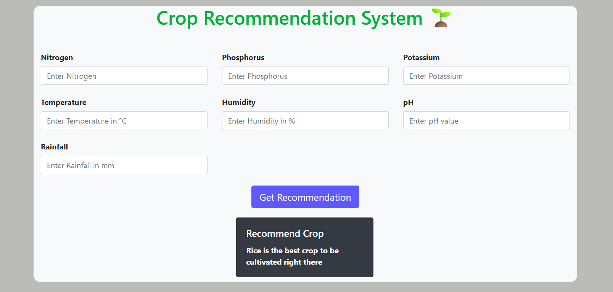

# 🌱 Crop Recommendation System

An end-to-end Machine Learning web application that recommends the most suitable crop to cultivate based on soil nutrients and environmental conditions.

---

## 🚀 Project Overview

This project uses a Machine Learning model trained on agricultural data to help farmers and agricultural enthusiasts make informed crop selection decisions. The model takes key parameters like Nitrogen, Phosphorus, Potassium, temperature, humidity, pH, and rainfall as input and predicts the best crop.

---

## 🎯 Features

* 🌾 Predicts the most suitable crop based on input conditions
* ⚙️ Built with Machine Learning (Random Forest Classifier)
* 🌐 Interactive web interface using Flask
* 📊 Real-time predictions
* 🧠 Trained on real-world agricultural dataset

---

## 🛠️ Tech Stack

* **Programming Language:** Python
* **Libraries:** Pandas, NumPy, Scikit-learn
* **Model:** Random Forest Classifier
* **Web Framework:** Flask
* **Frontend:** HTML, CSS, Bootstrap

---

## 📂 Project Structure

```
Crop-Recommendation-System/
│── app.py
│── model.pkl
│── requirements.txt
│
├── templates/
│     └── home.html
│
└── dataset/
      └── Crop_recommendation.csv
```

---

## ⚙️ Installation & Setup

### 1️⃣ Clone the repository

```
git clone https://github.com/your-username/Crop-Recommendation-System.git
cd Crop-Recommendation-System
```

### 2️⃣ Create virtual environment (optional but recommended)

```
conda create -n crop_env python=3.9
conda activate crop_env
```

### 3️⃣ Install dependencies

```
pip install -r requirements.txt
```

---

## ▶️ Run the Application

```
python app.py
```

Open your browser and go to:

```
http://127.0.0.1:5000/
```

---

## 📥 Input Parameters

| Parameter   | Description             |
| ----------- | ----------------------- |
| Nitrogen    | Soil Nitrogen content   |
| Phosphorus  | Soil Phosphorus content |
| Potassium   | Soil Potassium content  |
| Temperature | Temperature (°C)        |
| Humidity    | Humidity (%)            |
| pH          | Soil pH value           |
| Rainfall    | Rainfall (mm)           |

---

## 📊 Model Performance

* Algorithm: Random Forest Classifier
* Accuracy: ~97% (based on test dataset)

---

## 📸 Screenshots



---

## 🔮 Future Enhancements

* 🌍 Deploy on cloud (Render / AWS / Heroku)
* 📱 Mobile-friendly UI improvements
* 📈 Add visualization dashboards
* 🌐 API integration for real-time weather data

---

## 🤝 Contributing

Contributions are welcome! Feel free to fork this repo and submit a pull request.

---

## 📜 License

This project is open-source and available under the MIT License.

---

## 👨‍💻 Author

**Keerthi Vardhan Naidu**
📧 [nk.vardhannaidu@gmail.com](mailto:nk.vardhannaidu@gmail.com)
🔗 GitHub: https://github.com/Keerthivardhan1507
🔗 LinkedIn: https://linkedin.com/in/nettem-keerthi-vardhan-naidu

---

## ⭐ If you like this project

Give it a ⭐ on GitHub and share it!
